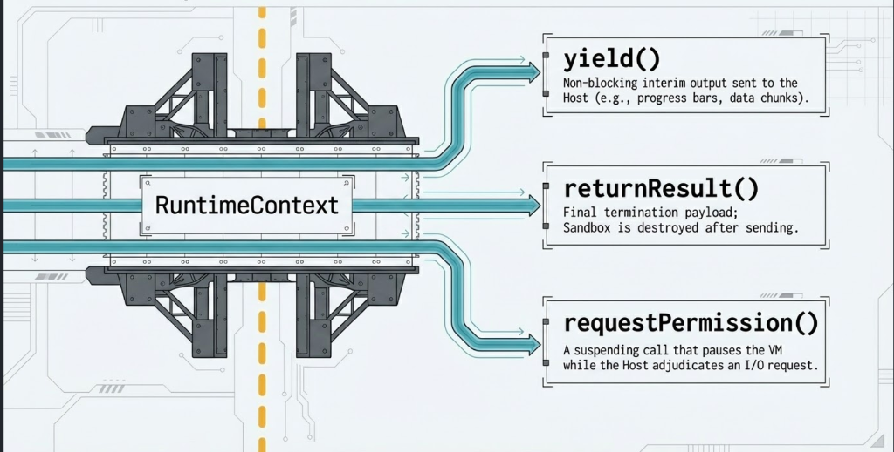

Hello there! _(Insert General Kenobi GIF :P)_ Welcome to the very first release of Nox!

> I should prefix this with a loud disclaimer: I am probably one of the last people who should be building a programming language. Everything I know about language design, compilers, etc came from building this project. And, if the alpha tag didn't make it obvious: Nox is far from production-ready. The standard library is tiny, plenty of bugs are probably hiding throughout the code, and there are weird syntax quirks in the language itself.

In this release, we're releasing the core language itself, a formatter, an LSP, and plugins for IntelliJ and VS Code, alongside various skills/extensions for Claude Code, Gemini CLI, Codex CLI, and an LLMS.txt.

You can see more on the [Ecosystem](../ecosystem) and [Download](../downloads) pages.


# Why I built Nox

One day I was using Github Copilot, and saw all the permission requests created by its various tools and wondered: how can you make an agent self-evolve and grow more capable over time?

To me, the answer was obvious: _AI agents write and create tools to build up a library of them._ 

But the security issues are just as obvious: an AI accidentally deleting a database, or reading things it shouldn't.

The right answer, it seemed to me, was to lean on an LLM's ability to look at the examples and documentation of a language it has never seen and write working code in it.

And so the idea of Nox was born.


# What is Nox, exactly?

Nox is a programming language designed to be a sandbox. There are plenty of languages and methods for building sandboxes, so what makes this one unique? In Nox, running code can ask for permission for the actions it's trying to take.

For example: a script wants to read a file -> Nox automatically asks for your permission before allowing it.

If you've used any vibe-coding tool, you already know what this looks like, it's the same flow as an agent asking before it runs a command.

So why build this instead of using Docker, a sandbox or a standard scripting engine?
Running scripts inside Docker or a VM is a heavyweight black box. Once a container starts, it either has file access or it doesn't. You can't inspect why it wants file access at runtime and selectively approve or deny it. (Seccomp exists but those solution are gated to specific OS's).

That's where Nox shines.


# The Pillars of Nox

1. **Zero Trust:** Exactly what it sounds like, and the most obvious one. It should be a sandbox. The script can do math and manipulate strings in memory all day, but the moment it wants to touch the outside world, it has to ask for permission. But those permissions are not static. The sandbox is built around the idea that a script can ask the host "Hey, can I read this file?" or "Can I fetch this API?" and the host can respond based on the context. See the [Interactive Permissions](#interactive-permissions) section for more info.

2. **Extensibility:** Nox should be easily embeddable in all kinds of applications, and host applications should be able to expose functionality with minimal boilerplate. If you need a new tool, you write a Kotlin function, throw an annotation on it, and Nox handles the rest. Need native access? Register a plugin through the C-ABI. See the [Extending Section](#extending-nox-tier-0-kotlin-plugins) section for more.

3. **Familiar:** C-family syntax, strict static typing, no classes, no generics, and no inheritance. The goal is to make it trivial for developers (and LLMs!) to read and write without learning a complex new paradigm. (Though, we do have some syntax sugars to make the lack of classes less painful.) See the [Language](#language-syntax-clean-typed-and-dynamic-ish) section for more.

4. **Resource Control (Watchdog Guard):** A script shouldn't be able to run `while(true) {}` and eat 100% of your host's CPU. See the [Resource Guards](#resource-control--graceful-quota-recovery) section for more info.


# Down the rabbit hole

Now for the sections that go a bit deeper into the core features. If you want to go deeper still, check out our [docs](../docs).

## Interactive Permissions

Traditional sandboxing (like Docker containers or process isolation) is **all-or-nothing**. You either give a process network access at startup, or you don't. But what if you want to allow an AI agent to query a weather API, but block it from sending your system keys to a random server? Or what if you want to allow it to read a specific configuration file but block it from reading your `~/.ssh/id_rsa`?

Nox is built around the idea of **Capability-Based Interactive Permissions**. The sandbox cannot access the host system directly. When a script calls a system function (like `File.read` or `Http.get`), the Virtual Machine suspends execution and sends a typed `PermissionRequest` to the host.



If the host grants the request, the script continues executing seamlessly. If the host denies it, the VM throws a catchable `SecurityError` inside the sandbox. Which means scripts can handle permission denied events instead of just dying.

## Resource Control & Graceful Quota Recovery
 
If interactive permissions decide _what_ a script may touch, resource control decides _how much_ it may consume and it leans on the exact same trick: the VM suspends and asks the host.
 
When you run untrusted scripts or let AI agents execute code on your server, you have to assume they might write an infinite loop (`while(true) {}`). Most sandboxes handle this by immediately killing the thread or process. But hard-killing a running program is a hammer since it leaves database transactions uncommitted, files partially written, and locks unreleased.
 
Nox solves this with a multi-layered watchdog system and our Dynamic Extension Protocol:
 
1. **Watchdog Guards:** The VM runs flat instruction counters (CPU Guard), tracks stack depth (Stack Guard), and monitors real-time execution duration (Wall-Clock Guard).

2. **The Dynamic Extension Request:** When a script trips one of these limits (e.g., executing more than 500,000 CPU instructions), the VM suspends and sends a `ResourceRequest` to the host application. The host can inspect the context and decide to dynamically extend the quota.

3. **Decaying Grace Periods:** If the host refuses to extend the limit, the VM doesn't just crash. It grants a temporary grace period: a small, decaying window of CPU cycles. This allows the script's `catch` or `finally` blocks to execute, letting it close open files, release resources, or yield a clean error message back to the host before the compiler-emitted `KILL` instruction terminates the program.

> The missing link here is the memory resource guard. For which, I don't really have any good solutions. One way is to see the memory allotment. But that is coarse and depends on when the garbage collector runs and how. And it also only detects after the memory limit is crossed, not before it is about to be crossed. I do want to release a memory resource guard, but I don't want to release something that causes as many issues as it stops.

## Language Syntax: Clean, Typed, and Dynamic-ish

I wanted a language that is statically typed to catch bugs early (because well that helps catch a lot of brainfarts and makes everyone's life much easier), but flexible enough to handle unstructured data (like random JSON from APIs). Here are some key highlights of the Nox Scripting Language (NSL):

### The Type System & Null-Safety

Nox has the standard primitive types (`int`, `double`, `boolean`) which are immutable and can **never** be null, alongside nullable reference types (`string`, arrays, and user-defined config structs). 

Structs are pure data schemas with no methods or inheritance:
```rust
type DatabaseConfig {
    string host;
    int port;
    string database;
}
```

To bridge the gap between structured code and dynamic API payloads, we made `json` a first-class type. Since Nox is built to run tools and talk to external APIs, it deals with JSON constantly and mapping raw JSON onto strict, statically-typed structs is normally a pain. 

So `json` is a first-class citizen with an `as` operator: you can cast any struct to `json` implicitly, or cast a `json` payload to a struct using `as`. The VM does schema-validation at runtime, if the structure matches, it casts it; if it doesn't, it throws a clean, catchable `CastError` rather than crashing the VM:

```rust
main(json payload) {
    // Cast and validate at runtime. Throws CastError if the structure doesn't match!
    DatabaseConfig db = payload.config as DatabaseConfig;
    
    // Or extract values safely with fallback defaults:
    string host = payload.getString("host", "localhost");
}
```

### Strict String Handling

To avoid JavaScript-style typing horrors, the `+` operator in Nox is strictly restricted to `string + string`. For string interpolation, you must use template literals with backticks:

```rust
int port = 3306;
string url = `mysql://localhost:${port}/nox`; // Clean and safe!
```

### Unified Function Call Syntax (UFCS)

Even though Nox doesn't have classes, you can call any global function as if it were a method on its first parameter:

```rust
type Point {
    double x;
    double y;
}

double distance(Point p, Point other) {
    return Math.sqrt(Math.pow(p.x - other.x, 2) + Math.pow(p.y - other.y, 2));
}

main() {
    Point origin = { x: 0.0, y: 0.0 };
    Point target = { x: 3.0, y: 4.0 };
    
    // These two are equivalent!
    double d1 = distance(origin, target);
    double d2 = origin.distance(target); // UFCS!
}
```

This is really helpful and allows us to do stuff like:


```rust
main(){

    string s = "Hello, world!";

    return s.split(",")[0].lower();
}
```

## Extending Nox: Tier 0 Kotlin Plugins

One of my primary design goals was making FFI (Foreign Function Interface) painless. In Nox, you write standard Kotlin/JVM code and annotate it. The KSP processor does all the boring code generation work:

```kotlin
@NoxModule(namespace = "MathExt")
object MathExtensions {
    @NoxFunction(name = "hypot")
    fun hypot(x: Double, y: Double): Double {
        return kotlin.math.hypot(x, y)
    }
}
```

If your function needs to check custom permissions or inspect the VM state, you can declare `RuntimeContext` as the first parameter. The VM will automatically inject the active sandbox context at runtime:
```kotlin
@NoxFunction(name = "readSecureKey")
fun readSecureKey(ctx: RuntimeContext, keyName: String): String {
    // Request a custom permission dynamically from the host!
    val response = ctx.requestPermission(PermissionRequest.Custom("key:read", keyName))
    if (response is PermissionResponse.Granted) {
        return fetchKeyFromHostVault(keyName)
    }
    throw SecurityException("Access denied")
}
```
Because the VM wraps all native executions, any crash or exception inside a plugin is mapped to a sandbox error. Your host application is completely shielded.

For even more details (or for those of you who caught the Tier 0 in the heading, and are curious about the other plugin tiers) check out the [plugin guide](../docs/extensibility/plugin-guide/).


# Design FAQ
 
A few questions you might have about the choices behind all this.
 
**Why not in Rust? Why not in xyz language?** While I wanted a fast-ish language, I didn't want to fail at the most important part: being a sandbox. Dealing with raw pointers felt like a bigger risk than necessary, and honestly, I don't know Rust or Go that well. Many other languages were ruled out because they can't be compiled down to a native binary. (Note: Nox compiles its Kotlin down to a native binary using [GraalVM](https://www.graalvm.org/latest/reference-manual/native-image/).) The final nail in the coffin: I use ANTLR to turn raw source files into an [AST](https://en.wikipedia.org/wiki/Abstract_syntax_tree) for the compiler, and I didn't want to give up a battle-tested library that made things much easier.
 
**A register-based VM?** A register-based VM cuts a lot of instruction-dispatch overhead and GC pressure compared to a stack machine. I'd recommend looking into [Lua](https://www.lua.org/doc/jucs05.pdf) if you want to dig deeper.
 
**Why no classes or inheritance?** Mainly because I wasn't sure how to easily implement OOP without significant effort. But by keeping the language simple - data-only `structs` plus **Unified Function Call Syntax (UFCS)** - you get the clean dot-syntax ergonomics of object-oriented code without any of the compile-time complexity.
 
**Why no user-defined generics?** Generics (like `List<T>`) are great, but they add a massive amount of complexity to the compiler's type checker.
 
For the alpha release, I wanted to keep the syntax as simple as possible. But under the hood, we still need basic collections (like `int[]` or `string[]`) to work. To solve this, the compiler uses a name-mangling strategy: when you call `.push()` on an `int[]`, the compiler generates a specific bytecode target like `push!int` at the VM level, which resolves to an optimized JVM adapter at runtime.
 
Just to be clear: I do want to add proper user-defined generics to the language in the future! But for `0.0.1-alpha`, keeping the compiler simple was the priority.
 
**Wait, why static typing? Wouldn't dynamic typing (like Python or JS) be easier for AI?** Actually, no! Dynamic languages are a nightmare for AI tool generation, because the code runs and then blows up halfway through execution because of a type mismatch. Static typing forces the compiler to validate the structure of the program before it runs. If an agent (or me at 2 a.m.) passes a `string` to a function expecting an `int`, the compiler catches it instantly. This is quite cheap and exactly what the agentic loop is built for. Also as a cool side-effect, it helps make the runtime much faster.
 
**Why is there a `yield` keyword?** Honestly, it's a leftover from Nox's first life as an MCP server, before I realized it had plenty of uses beyond letting LLMs write sandboxed code. The original problem: standard tools only return a single payload at the very end of execution. But if an AI agent is running a long task, you might want feedback while the script runs. `yield` lets a script stream status updates or intermediate results back to the host application in real time. It also doubles as the print function.


# The Road Ahead

This `0.0.1-alpha` release is the first step towards a secure, standard runtime for AI agents and embeddable scripting. I'm actively working on expanding the standard library, optimizing VM loop performance, and hardening the security boundaries.

I'd  love to hear your feedback! Go check out the [GitHub repo](https://github.com/deepsarda/Nox), try embedding the runtime in your Kotlin or Java projects, and join our GitHub Discussions to share what you build (or more realistically: all the stuff you broke).